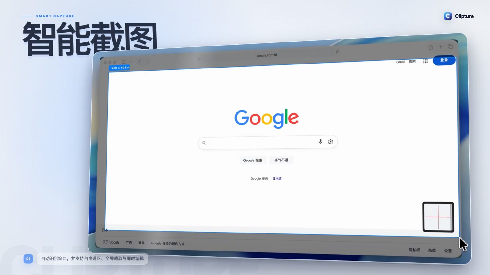

  

<h1 align="center">Clipture</h1>

Mac 与 Windows 截图、长图和剪贴板工具。

  <a href="https://clipture.talkape.net/downloads/Clipture.dmg"><strong>下载 Mac 版</strong></a>
  · <a href="https://apps.microsoft.com/detail/9NVGQ229KL1S"><strong>从 Microsoft Store 获取</strong></a>
  · <a href="https://clipture.talkape.net/zh">官网</a>
  · <a href="https://github.com/tageecc/clipture/releases/latest">版本记录</a>
  · <a href="README.md">English</a>

  

Clipture 把常用截图工具和本地剪贴板历史放在一个桌面应用里。它可以截取选区或窗口、生成滚动长图、添加标注、在本地识别文字、把截图置顶，并搜索之前复制的文本、图片和文件。

## 主要功能

- 智能选区和窗口截图，按住 Shift 可以同时选择多个窗口
- 自动滚动、采样并拼接成长图
- 矩形、圆形、直线、箭头、马赛克、文字和步骤标注
- 本地文字识别，可直接选择截图中的文字
- 取色与截图置顶
- 搜索本机剪贴板历史中的文本、图片和文件列表
- 全局快捷键、中英文界面

## 系统要求

| 项目 | 说明 |
| --- | --- |
| macOS | macOS 13 或更高版本 |
| 芯片 | 原生支持 Apple 芯片与 Intel（Universal 2） |
| Windows | Windows 10 或 11，分别提供 x64 与 ARM64 版本 |
| Mac 官网安装包 | Developer ID 签名并通过 Apple 公证 |
| Windows 安装包 | Microsoft Store 提供 x64 与 ARM64 版本 |
| Windows 更新 | 由 Microsoft Store 自动完成 |
| Mac 更新 | 官网版可以在应用内检查更新 |

当前所有功能都可以免费使用。自愿的一次性赞助只会关闭偶尔出现的赞助提醒。

## 安装

### macOS

1. 从[官网](https://clipture.talkape.net/downloads/Clipture.dmg)或 [GitHub Releases](https://github.com/tageecc/clipture/releases) 下载 DMG。
2. 把 Clipture 拖入“应用程序”。
3. 打开 Clipture，并在 macOS 提示时授予屏幕录制权限。只有自动滚动和剪贴板历史直接粘贴需要辅助功能权限。

### Windows

1. 打开 [Microsoft Store 中的 Clipture](https://apps.microsoft.com/detail/9NVGQ229KL1S)。
2. 点击“安装”。Microsoft Store 会自动选择适合当前电脑的 x64 或 ARM64 版本，完成应用验证，并负责后续更新。

更多说明见[安装与权限](docs/installation.md)。

## 隐私

截图、标注、文字识别和剪贴板历史都在当前设备处理，不会上传截图内容。设置中的匿名功能使用统计可以随时关闭。

完整说明见[隐私政策](https://clipture.talkape.net/zh/privacy)。

## 反馈

- [反馈可以复现的问题](https://github.com/tageecc/clipture/issues/new?template=bug_report.yml)
- [提出功能或体验建议](https://github.com/tageecc/clipture/issues/new?template=feature_request.yml)
- [讨论一般问题](https://github.com/tageecc/clipture/discussions)
- 支付、许可证、隐私或安全问题请使用[私密支持入口](https://clipture.talkape.net/zh/support)。

公开提交前，请移除截图内容、剪贴板内容、邮箱、许可证和其他隐私信息。

## 赞助名单

赞助默认不公开。只有明确同意展示的用户才会出现在 [SPONSORS.md](SPONSORS.md)；支付邮箱和交易信息不会公开。

## 仓库说明

这个公开仓库只保存产品文档、安装包、版本记录和反馈，不包含 Clipture 的专有源代码。具体说明见 [LICENSE.md](LICENSE.md)。

Clipture 由[对话猿（杭州）科技有限公司](https://clipture.talkape.net/zh/about)开发。
